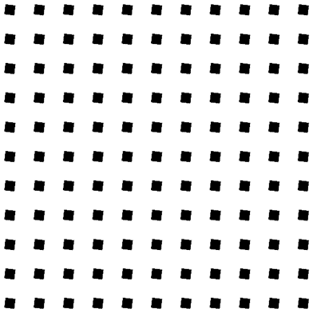
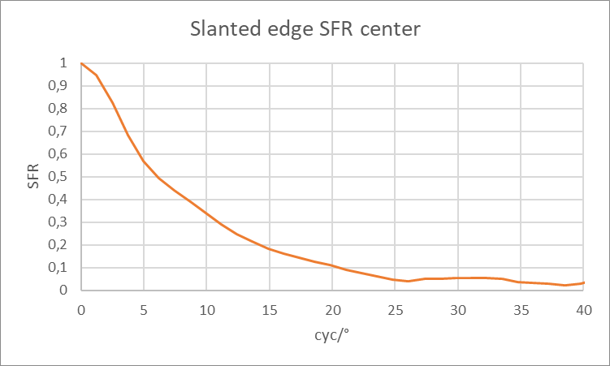

# Michelson对比度

Michelson对比度与对比度传递函数（CFT）相同。在近眼显示的情况下，Michelson对比度通常也被称为MTF（调制传递函数）。

## 光测量设备（LMD）

Instrument Systems LumiTop 5300 ARVR (2D光测量设备)

- 入瞳（Entrance pupil）：3mm

- 焦距：1000mm

## **被测设备（DUT）**

配备Pancake光学元件和 TFT-LCD 显示屏的NED设备，分辨率为 1600 px x 1600 px。

## 测试图案

Michelson对比度的测试图案如下图中展示的所示：

- 由2像素黑色和2像素白色组成的线条
- 测试图案尺寸为1600像素x 1600像素
- 水平对齐

图1：用于测量Michelson对比度的测试图案

## 测量

测量过程采用了极坐标畸变设置。这种设置有助于更准确地分析和校正图像的畸变，特别是在需要考虑图像中心和边缘区域畸变差异的情况下。

## 分析

Michelson对比度 $C_{m,i}$可以通过以下方式计算：
$$
C_{m,i}=\frac{L_{vM,i}-L_{vm,i}}{L_{vM,i}+L_{vm,i}}
$$
其中，

- $C_{m,i}$ 表示在点$P_i$的Michelson对比度，
- $L_{vM,i}$ 表示在点$P_i$图像中的最大亮度，
- $L_{vm,i}$ 表示在点$P_i$图像中的最小亮度。

**提示：**大部分光测量设备系统并非衍射受限设计，这意味着它不能用于测量光学系统（如NED）的绝对Michelson对比度值。不过，只要Michelson对比度值不是太低（即空间频率不是太高，>0.2或20%），就可以进行DUT之间的比较。这种比较有助于评估不同设备之间的性能差异。

# 斜边分析

斜边分析是一种用于测量图像锐度的方法，虽它并不是专门为测量NED而定义的。使用斜边分析的优势在于，它能够提供完整空间频率范围的空间频率响应（SFR）。

## 光测量设备（LMD）

Instrument Systems LumiTop 5300 ARVR (2D光测量设备)

- 入瞳（Entrance pupil）：3mm

- 焦距：1000mm

## **被测设备（DUT）**

配备Pancake光学元件和 TFT-LCD 显示屏的NED设备，分辨率为 1600 px x 1600 px。

## 测试图案

斜边的测试图案如下图中展示的所示：

- 由11x11的方格组成
- 测试图案尺寸为1600像素x 1600像素
- 方格之间的距离为100像素
- 每个方格的大小为50像素

图2：用于测量斜边的测试图案

## 测量

测量过程采用了极坐标畸变设置，这种设置能够将测量的单位从每像素周期（cyc/px）转换为每度周期（cyc/°）。这种转换有助于更准确地评估图像在不同视角下的性能，特别是在需要考虑图像在宽视角范围内的显示效果时。

## 分析

每像素周期（cyc/px）乃是空间频率的单位，此像素与图像中的像素相互对应。若要将该单位转变为更具直观性的单位，诸如每度周期（cyc/°），推荐采用极坐标设置充当去畸变的方法，从而能够直接获取具有角度坐标的图像。借由运用从像素至度的转换因子，空间频率能够依据以下关系予以转换：
$$
c=转换因子（px/°）
$$

$$
空间频率 [cyc/°] = 空间频率 [cyc/px] * c
$$

这个转换有助于将空间频率的测量结果从像素单位转换为角度单位，从而更直观地评估图像在不同视角下的性能。

图3：数据已转换为每度周期（cyc/°）的形式，以利于更直观地理解并使用这些数据。

**提示：**大部分光测量设备系统并非衍射受限设计，这意味着它不能用于测量光学系统（如NED）的绝对空间频率响应（SFR）值。不过，只要SFR值不是太低（即空间频率不是太高，>0.2或20%），就可以进行DUT之间的比较。这种比较有助于评估不同设备之间的性能差异。