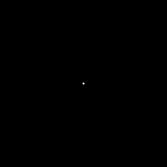
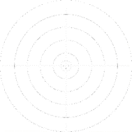
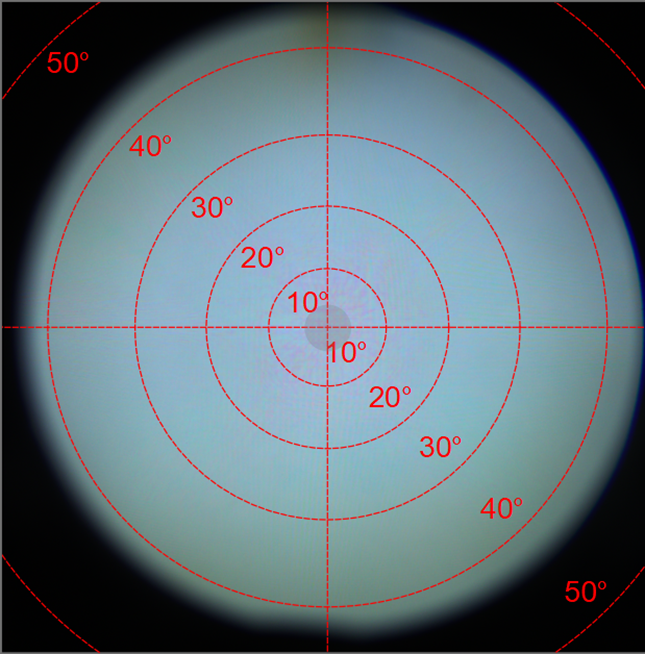
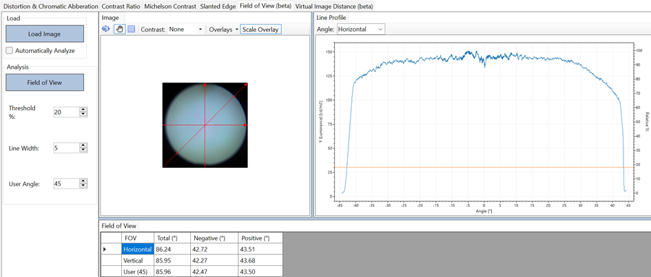
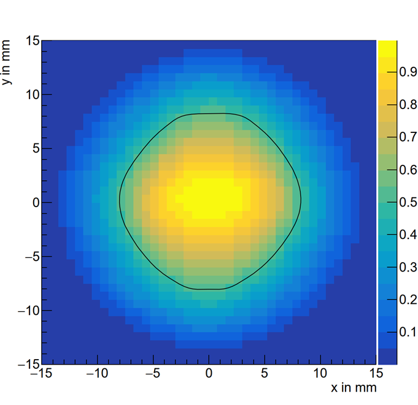
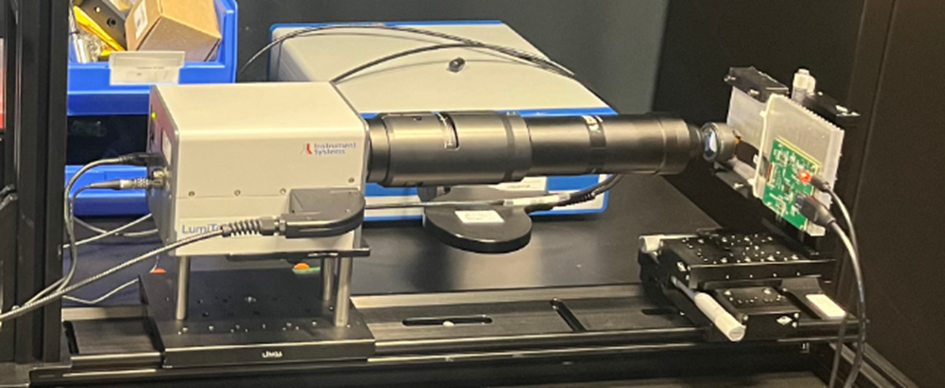
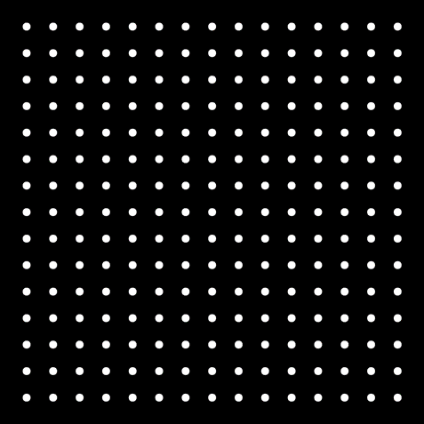
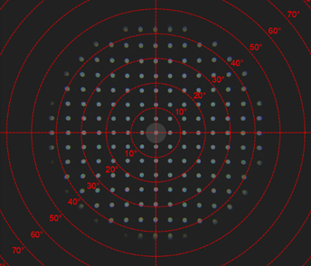
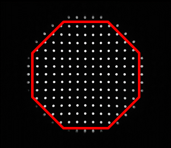
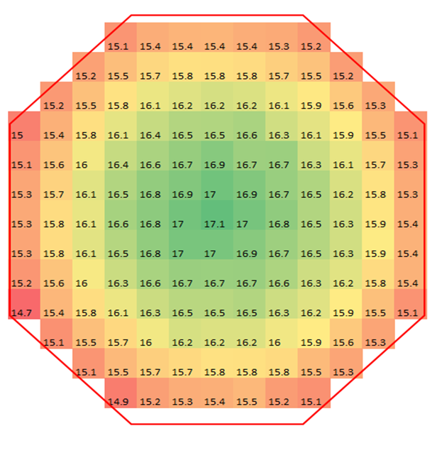

# 虚拟图像距离测量（2D光测量设备）

利用2D光学测量设备或点光源测量技术，我们能够精确测量虚拟图像的距离。以下案例演示了如何使用2D光测量设备采用视差法进行测量。这一技术要求收集至少两个数据点以进行准确评估。

## 光测量设备（LMD）

Instrument Systems LumiTop 5300 ARVR (2D光测量设备)

- 入瞳（Entrance pupil）：3mm

- 焦距：1000mm

## **被测设备（DUT）**

- 配备Pancake光学元件以及 OLEDonSi 显示屏的NED设备，分辨率为  2560 px x 2560 px。
- NED允许将屈光度设置从+1 dpt调整为-5 dpt。

## 测试图案

图1：采用单点图案进行虚拟图像距离测量

## 测量

为了执行测量，必须将待测设备（DUT）或光测量设备（LMD）相对于人眼位置在x轴或y轴方向上移动特定的距离。以下是测量流程：

1. 将设备从人眼位置沿x轴向左移动3毫米。
2. 在此新位置捕捉图像。
3. 随后，将设备从人眼位置沿x轴向右移动3毫米。
4. 再次捕捉图像。

测量过程中采用极坐标系统，这便于直接进行角度的测量。

## 分析

屈光度及其范围是通过获得的焦距范围的倒数来计算的：
$$
D_0=\frac{1}{γ_o}
$$
其中，

$D_o$代表在P0（中心）点的屈光度,

$γ_o$代表在P0（中心）点的焦距（米）。

# 虚拟图像距离测量（点光测量设备）

## 光测量设备（LMD）

Instrument Systems DMS803 (测角光度计）。

## **被测设备（DUT）**

配备Pancake光学元件以及 OLEDonSi 显示屏的NED设备，分辨率为  2560 px x 2560 px。

## 测试图案

使用十字准线图案。

图2：用于虚拟图像距离测量的十字准线图案

## 测量

- 通过测角光度计的角度调节装置，将十字准线图案精确对准取景器中心，并记录当前的角度值。
- 将设备从人眼位置沿x轴向右移动3毫米。
- 再次使用测角光度计的角度调节装置，将十字准线图案重新对准取景器中心，并记录新的角度值。

备注：测角光度计系统已配置为仅响应φ角的变化，因此沿x轴的移动将直接导致φ角的变化。

| x轴位置（单位：毫米） | φ角（单位：°） |
| --------------------- | -------------- |
| -3                    | -0.64          |
| 3                     | 0.71           |

表1：φ角测量结果

## 分析

虚拟图像距离是通过计算两点之间的位移和测量的角度来得出的。
$$
VID_m=\frac{Δx}{tan⁡(Ω)}
$$

| 测量值W                 | 1.35°=0.71°-(-0.64°) |
| :---------------------- | :------------------- |
| Δx（位置变化）          | 6 mm                 |
| 测量得到的$VID_m$（米） | 0.254                |
| DUT预期的$VID_m$（米）  | 0.25                 |

表2：虚拟图像距离测量结果

# 通过亮度测量视场

## 光测量设备（LMD）

Instrument Systems LumiTop 5300 ARVR (2D光测量设备)

- 入瞳（Entrance pupil）：3mm

- 焦距：1000mm

## **被测设备（DUT）**

配备Pancake光学元件以及 OLEDonSi 显示屏的NED设备，分辨率为  2560 px x 2560 px。

## 测试图案

使用纯白图案。

## 测量

测量的图像如下图所示。

图3：白色图案的测量图像

## 分析

图4：视场分析截图

分析结果总结在表1中（亮度阈值为中心亮度的20%）。

| **视场**   | **总和 (°)** | **负 (°)** | **正 (°)** |
| ---------- | ------------ | ---------- | ---------- |
| 水平       | 86.24        | 42.72      | 43.51      |
| 垂直       | 85.95        | 42.27      | 43.68      |
| 用户 (45°) | 85.96        | 42.47      | 43.50      |

表3：视场分析结果

# 眼盒测量

## 光测量设备（LMD）

Instrument Systems DMS803 (测角光度计）。

## **被测设备（DUT）**

配备Pancake光学元件以及 OLEDonSi 显示屏的NED设备，分辨率为  2560 px x 2560 px。

## 测试图案

使用纯白图案。

## 测量

在θ=0°，φ=0°的基准条件下进行测量，测量范围设定为x轴从-15毫米至15毫米，以及y轴从-15毫米至15毫米。

## 分析

以亮度下降至中心亮度的50%作为评判标准。

图6：眼距为12毫米时的眼盒扫描图。图中展示了相对亮度分布。黑线标示出亮度下降至50%的临界区域。

对于所选的眼盒标准，其宽度和高度参数如下表所示：

| 轴向          | 眼盒尺寸（毫米） |
| :------------ | :--------------- |
| x轴 (y=0毫米) | 16.3             |
| y轴 (x=0毫米) | 16.3             |

表4：眼盒测量结果

备注：通过扫描方位角和高度角而不是x和y轴来测量和分析视场的方法非常相似。

# 像素密度测量

## 光测量设备（LMD）

Instrument Systems LumiTop 5300 ARVR (2D光测量设备)

- 入瞳（Entrance pupil）：3mm
- 焦距：1000mm

图7：像素密度测量的测量平台

## **被测设备（DUT）**

配备Pancake光学元件和 TFT-LCD 显示屏的NED设备，分辨率为 1600 px x 1600 px。

## 测试图案

使用用于畸变测量的斑点图案：

- 由15x15个斑点组成。
- 测试图案的整体尺寸为1600像素x1600像素。
- 斑点之间的间隔设定为100像素。
- 每个斑点的半径为15像素。

图8：用于像素密度测量的斑点图案

## 测量

图9：用于数据分析的选定斑点（上）以及同一图像上叠加的视场范围（下）

## 分析

- 首先计算每个斑点的面积。
- 在图像中，每个像素对应的角度为0.02396°，这是通过极坐标校准得到的转换因子c。
- PAD（像素每度）的计算方法如下：
  - 显示设备上斑点的面积（测试图案）为a=709像素²。
  - 使用光测量设备测量的斑点面积。
  - 斑点的PAD计算公式为 $PAD_{blob}=\sqrt{\frac{a}{A*c^2}}$，其中单位为像素每度（px/deg，即ppd）。
- 下图展示了不同斑点的PAD值。
- 中心位置的PAD值最优，达到17.1 PPD。
- 在图像的边缘区域，PAD值降至大约15 PPD。

图10：像素密度结果