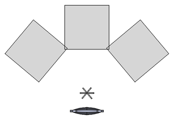
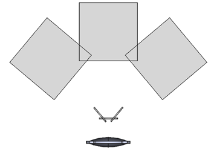
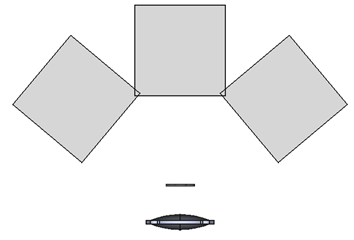

# LMD设备规格要求

**IEC-63145-20-10:2019 标准**：

依据IEC-63145-20-10:2019标准，光测量设备的入瞳直径应介于2 mm至5 mm之间，且不得大于待测设备（DUT）的输出光场。同时，设备的角度精度需控制在0.1°以内，平移台的定位精度相对于光测量设备（LMD）/待测设备（DUT）应达到0.05 mm或更优。

**ICDM 标准**：

根据ICDM（Information Display Measurements Standard-V1.1a, 2022）标准，建议角度精度为0.05°，在特定情况下可放宽至0.1°。平移台的精度应达到显示屏幕对角线的0.1%。

# LMD功能要求

成像光测量设备（ILMD）应能提供待测设备（DUT）的2D图像。为了与点光测量设备（LMD）的数据进行比较，通常需要需要根据设备不同的视场（FOV）进行笛卡尔坐标系与球面坐标系之间的转换如果。ILMD支持极坐标，则在比较时应优先使用，例如与光度计设备进行比较时。

## 成像光测量设备（ILMD）标准

**IEC-63145-20-10:2019 标准**：

- 光谱范围测量范围应为380 nm至780 nm。
- 带宽应小于5 nm。
- 波长精度应小于0.3 nm。
- 2D 成像 LMD 应采用滤波器类型的 LMD。
- 2D 成像 LMD 的像素数量应不少于测量场内虚拟图像子像素数量的 4 倍。

**ICDM 标准**：

- **亮度测量**：对于CIE A光源的亮度测量，要求测量结果的相对不确定度（考虑2倍覆盖因子）不超过4%，且在5分钟内的重复性误差不超过0.4%。此外，测量设备的相对光谱响应率与V(λ)曲线的偏差应小于或等于8%。

- **照明测量**：在对CIE A光源进行照明测量时，测量结果的相对不确定度（考虑2倍覆盖因子）应不超过4%，5分钟内的重复性误差应小于0.4%。相对光谱响应率与V(λ)曲线的偏差应小于8%，且方向响应误差不超过2%。
- **色度测量**：对于CIE A光源的色度测量，所有测量设备在测定CIE 1931 (x,y)色度坐标时，其扩展不确定度（考虑2倍覆盖因子）不应超过0.005，且重复性误差应小于0.002。
- **辐射亮度测量**：对于覆盖380 nm至780 nm范围的光谱辐射计，其在400 nm至700 nm范围内的相对扩展不确定度（考虑2倍覆盖因子）应小于或等于2%，而在380 nm至400 nm和700 nm至780 nm范围内的相对扩展不确定度应小于或等于5%。
- **阵列探测器测量**：对于CIE A光源均匀源的亮度测量，使用阵列探测器时，测量结果的相对不确定度（考虑2倍覆盖因子）应不超过4%，5分钟内的重复性误差应小于0.4%。相对光谱响应率与V(λ)曲线的偏差应小于8%，且任意10×10像素测量区域的平均值在50% ± 10%饱和度时，应与整个阵列的平均值相差在2%以内。

## 测角光度计（Goniophotometer） 标准

**IEC-63145-20-10:2019标准**：

- 光谱范围：380 nm - 780 nm。
- 带宽：< 5 nm。
- 波长准确度：< 0.3 nm。
- 双轴光度计。
- 角度准确度：≤ 0.1°。
- 三轴平移台：平移准确度≤ 0.05 mm。

# 6.3 测量场景

根据需求，可能存在不同的测量场景。关键在于是否采用瞳孔点（pupil point）或眼动点（eye rotation point）进行测量。当需要将2D光测量设备与点光测量设备直接比较，以评估DUT的全视场时，这种情况属于类型3（见表1）。

| 对齐类型                                                     | 示意图                                                       |
| ------------------------------------------------------------ | ------------------------------------------------------------ |
| 类型1：瞳孔固定于LMD **旋转点：瞳孔点** 当LMD旋转时，能看到DUT的不同视角，测量孔径随之改变。不反映自然现实。ICDM推荐使用此方法。 |  |
| 类型2：瞳孔固定于LMD **旋转点：眼动点** 当LMD旋转时，能看到DUT的不同视角，测量孔径随之改变，反映自然现实。IEC推荐使用此方法。 |  |
| 类型3：瞳孔不固定于LMD **旋转点：瞳孔点** 当LMD旋转时，能看到DUT的不同视角，而测量孔径保持不变。 在使用2D光测量设备与点光测量设备比较时，保持DUT的非倾斜视图至关重要。 |  |

表1：不同类型的LMD与视场组合（注：灰色框代表LMD，镜头代表DUT，之间的细线代表视场或孔径）

