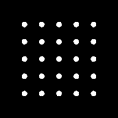
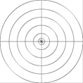
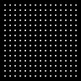
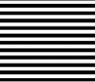
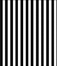
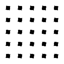
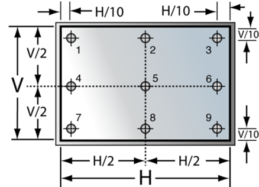

# 测试方法概述

| #    | 测试方法                                                  | 2D   | 点   | 移动点 | 移动2D |
| ---- | --------------------------------------------------------- | ---- | ---- | ------ | ------ |
| 1    | 眼点对齐（ICDM）                                          | ☒    | ☒    | ☒      | ☒      |
| 2    | 使用十字线进行眼点对准（ICDM）                            | ☒    | ☐    | ☐      | ☒      |
| 3    | 使用中心亮度进行眼点对准（ICDM）                          | ☒    | ☒    | ☒      | ☒      |
| 4    | 使用中心分辨率进行眼点对准（ICDM）                        | ☒    | ☐    | ☐      | ☒      |
| 5    | 使用视场进行眼点对准（ICDM）                              | ☒    | ☐    | ☐      | ☒      |
| 6    | 利用横向色差对NED眼盒进行中心定位（ICDM）                 | ☒    | ☐    | ☐      | ☒      |
| 7    | 利用彗差、散光、场曲率对NED眼盒进行中心定位（ICDM）       | ☒    | ☐    | ☐      | ☒      |
| 8    | 采用全视场亮度法进行眼点对准（IEC-63145-20-10:2019）      | ☒    | ☐    | ☐      | ☒      |
| 9    | 采用Michelson对比度法进行眼点对准（IEC-63145-20-10:2019） | ☒    | ☐    | ☐      | ☒      |
| 10   | 亮度测量（IEC-63145-20-10:2019）                          | ☒    | ☒    | ☒      | ☐      |
| 11   | 亮度和对比度均匀性测量（ICDM ）                           | ☒    | ☒    | ☒      | ☐      |
| 12   | 色度和色域测量（IEC-63145-20-10:2019）                    | ☒    | ☒    | ☒      | ☐      |
| 13   | 色度色域面积均匀性测量（ICDM）                            | ☒    | ☒    | ☒      | ☐      |
| 14   | 色度均匀性测量（IEC-63145-20-10:2019）                    | ☒    | ☒    | ☒      | ☐      |
| 15   | 色度均匀性测量（ICDM）                                    | ☒    | ☒    | ☒      | ☐      |
| 16   | 对比度测量（IEC-63145-20-10:2019）                        | ☒    | ☒    | ☒      | ☐      |
| 17   | 使用大视场LMD测量棋盘格图案的对比度（ICDM）               | ☒    | ☐    | ☐      | ☐      |
| 18   | 使用小视场LMD测量棋盘格图案的对比度（ICDM）               | ☒    | ☒    | ☒      | ☒      |
| 19   | FOV 亮度测量法（IEC-63145-20-10:2019）                    | ☒    | ☒    | ☒      | ☐      |
| 20   | FOV Michelson对比度测量法（IEC-63145-20-20:2019）         | ☒    | ☐    | ☐      | ☐      |
| 21   | NED 视场角测量（ICDM）                                    | ☒    | ☒    | ☒      | ☐      |
| 22   | FOV 亮度测量法（ICDM）                                    | ☒    | ☒    | ☒      | ☐      |
| 23   | FOV Michelson对比度测量法（ICDM）                         | ☒    | ☐    | ☐      | ☐      |
| 24   | 眼盒亮度测量法（IEC-63145-20-10:2019）                    | ☒    | ☒    | ☒      | ☒      |
| 25   | 眼盒Michelson对比度测量法（IEC-63145-20-20:2019）         | ☒    | ☐    | ☐      | ☒      |
| 26   | 眼盒中心亮度方法（ICDM）                                  | ☒    | ☒    | ☒      | ☒      |
| 27   | 眼盒Michelson对比度测量法（ICDM）                         | ☒    | ☐    | ☐      | ☒      |
| 28   | 眼盒Draper 方法（ICDM）                                   | ☒    | ☐    | ☐      | ☒      |
| 29   | 眼盒基于亮度的视场角方法（ICDM）                          | ☒    | ☒    | ☒      | ☒      |
| 30   | 眼盒基于Michelson对比度的视场角方法（ICDM）               | ☒    | ☐    | ☐      | ☒      |
| 31   | 标准畸变测量（IEC-63145-20-20:2019）                      | ☒    | ☒    | ☒      | ☐      |
| 32   | NED局部几何畸变测量（ICDM）                               | ☒    | ☐    | ☐      | ☐      |
| 33   | 颜色配准误差标准测量（IEC-63145-20-20:2019）              | ☒    | ☒    | ☒      | ☒      |
| 34   | 标准Michelson对比度测量（IEC-63145-20-20:2019）           | ☒    | ☐    | ☐      | ☐      |
| 35   | Michelson对比度均匀性测量（ICDM）                         | ☒    | ☐    | ☐      | ☒      |
| 36   | 焦距测量（IEC-63145-20-20:2019）                          | ☒    | ☐    | ☐      | ☒      |
| 37   | 视差测量（IEC-63145-20-20:2019）                          | ☒    | ☒    | ☐      | ☒      |
| 38   | 虚拟图像距离（K. Guo 2019）                               | ☒    | ☐    | ☐      | ☐      |
| 39   | 虚拟图像距离测量：使用LMD镜头焦点（ICDM）                 | ☒    | ☐    | ☐      | ☒      |
| 40   | 在视场角内的虚拟图像距离（ICDM）                          | ☒    | ☐    | ☐      | ☒      |
| 41   | 空间测量（ICDM）                                          | ☒    | ☐    | ☐      | ☐      |
| 42   | 信号对比度（ICDM）                                        | ☒    | ☒    | ☐      | ☐      |
| 43   | 双视自动立体系统串扰（ICDM）                              | ☒    | ☒    | ☐      | ☐      |
| 44   | 伽马和灰度失真（ICDM）                                    | ☒    | ☒    | ☐      | ☐      |
| 45   | 伽马值测量 （DFF）                                        | ☒    | ☒    | ☐      | ☐      |
| 49   | 像素角密度（IEC-63145-20-10:2019）                        | ☒    | ☐    | ☐      | ☐      |

表1：测试方法概述

# 测试图案

| #    | 图案                                                         | 示例                                                         |
| ---- | ------------------------------------------------------------ | ------------------------------------------------------------ |
| 1    | 全实心图案：指以单一颜色（通常是白色、红色、绿色或蓝色）展现显示分辨率的图案。 |  |
| 2    | 斑点状图案                                                   |  |
| 3    | 棋盘格图案                                                   |  |
| 4    | 对齐图案                                                     |  |
| 5    | 用于Michelson对比度的格栅图案                                |  |
| 6    | 倾斜边缘图案                                                 |  |

表2：测试图案概览

# 测量点位的定义

在现行标准中，为了准确评估参数如均匀性，通常规定了5个或9个测量点。这些测量点的具体位置是基于显示器的尺寸来决定的（参见图1）。对于增强现实（AR）、虚拟现实（VR）以及混合现实（MR）的组件或头戴设备，鉴于显示位置与视场内位置之间的关系往往不易确定，测量点也可以依据视场（FOV）来设定。图2提供了一个以FOV为参考的示例。考虑到FOV或显示器的形状可能存在差异，测量点的位置应当进行适当调整，以确保评价结果的准确性和有效性。

图1：使用显示尺寸定义测量位置的示例

图2：在视场（FOV）尺寸中定义测量点