# 测量设置

测量过程的第一步是进行可重复的校准。这主要意味着要找到一个起始点，该点可以用于眼动扫描等操作。ICDM和IEC标准提供了一些校准程序。同时，还需要确定在测量中应使用的旋转参考点。可以选择瞳孔旋转点或眼球旋转点作为旋转的参考。眼球旋转点更为真实，因为它模拟了人眼的注视方向（见图 1）。眼球旋转点位于瞳孔点后 10 毫米处（见图 2）。眼球的移动会导致注视方向的明显变化（见图 3）。关于校准与测量的不同情境，请参见表 1。

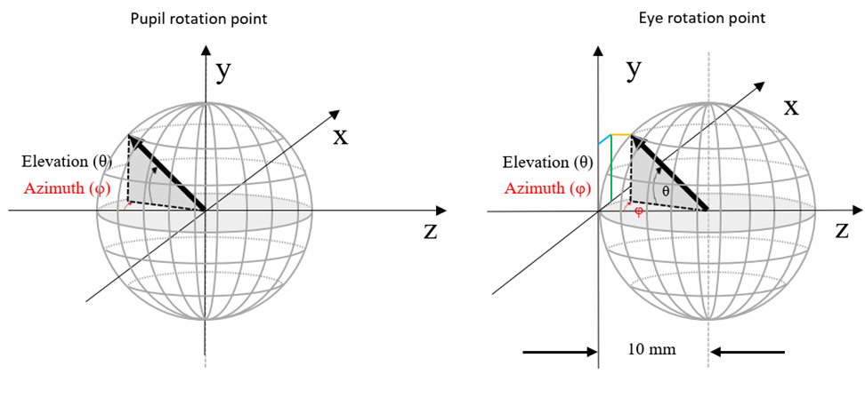

图1：旋转点的不同定义

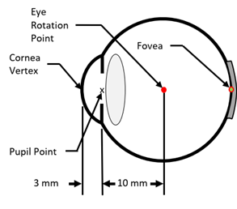

图2：标准眼球的几何结构

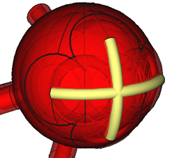

图3：黄色区域显示眼睛在水平方向（左右 50°）和垂直方向（上下 40°）的最大转动范围。

| 对齐类型                                                     | 示意图                                                       |
| ------------------------------------------------------------ | ------------------------------------------------------------ |
| 类型1：瞳孔固定于LMD **旋转点：瞳孔点** 当LMD旋转时，能看到DUT的不同视角，测量孔径随之改变。不反映自然现实。ICDM推荐使用此方法。 |  |
| 类型2：瞳孔固定于LMD **旋转点：眼动点** 当LMD旋转时，能看到DUT的不同视角，测量孔径随之改变，反映自然现实。IEC推荐使用此方法。 |  |
| 类型3：瞳孔不固定于LMD **旋转点：瞳孔点** 当LMD旋转时，能看到DUT的不同视角，而测量孔径保持不变。 在使用2D光测量设备与点光测量设备比较时，保持DUT的非倾斜视图至关重要。 |  |

表1 不同类型的LMD与视场组合（注：灰色框代表LMD，镜头代表DUT，之间的细线代表视场或孔径）

## 测量机械平台

为保证测量条件一致且可重复，点光测量设备和 2D 光测量设备的设置应相近，从而确保测量结果具有可比性。其中一个关键点是待测设备（DUT）与光测量设备（LMD）的正确对齐。

根据IEC 标准的建议，设置应满足以下精确度要求：

- x, y, z 轴的精度 < 0.05 毫米
- α（倾斜角）, Ψ（方位角）的精度 < 0.1°

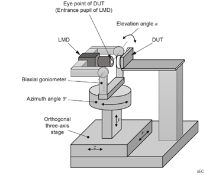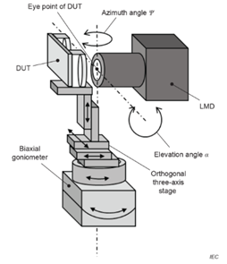

图4：基于 IEC 标准的基本装置配置。

可能的解决方案包括：

- 配备平移和旋转平台的测角仪（参见图5）
- 六轴运动控制系统
- 机械臂

机械装置一般由多个移动元件组成，如下图所示。确保所有元件的坐标系统相互对齐，对实现精确可靠的运动至关重要。

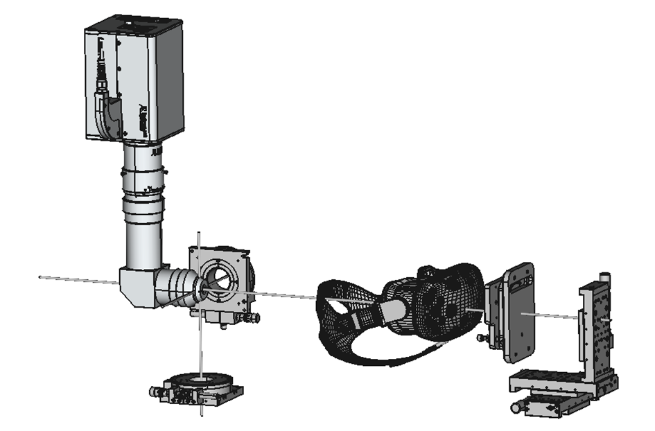

图5：所需装置的总体视图（爆炸示意图）

# 对齐流程

## 准备工作

在将被测设备（DUT）与测量设备对齐之前，务必确保光测量设备（LMD）的光轴与机械平移台精准对齐。比如，可以用激光束穿过光测量设备的光纤，以此检查 LMD 的光轴是否与导轨系统平行。或者在 XYZ 导轨系统上装一面镜子，把激光反射回 2D 光测量设备。这样能保证其他支架，如平移台，已经与2D光测量设备很好地对齐了。

## 对齐流程

对齐的目的是使光测量设备（LMD）的坐标系与被测设备（DUT）的坐标系对齐，使它们的轴重合。图6清楚地展示了对齐的目标。

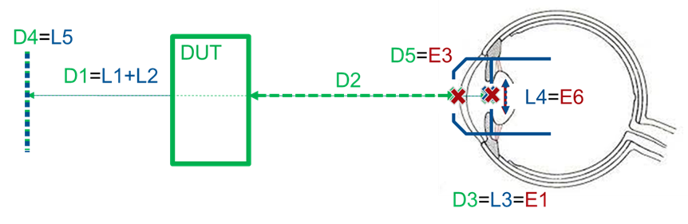

图6：LMD和DUT的对齐坐标系统。

### 十字准线对齐

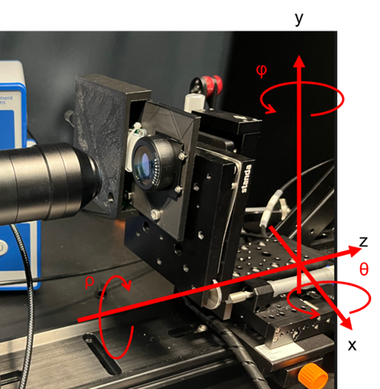

在对齐过程中，以下几何参数是需要重点考虑的关键因素：

- φ 方位角：控制设备在水平面的旋转。
- θ 仰角：控制设备在垂直面的旋转。
- ρ 旋转：涉及设备绕自身轴的旋转。
- z 轴：用于调整眼距，即设备与观察者眼睛之间的距离。
- x, y 或其他笛卡尔坐标：用于调整设备在水平面内的位置。

在理想情况下，AR/VR光学测量设备的光轴应与光学导轨保持平行，以确保测量的精确性。这一对准过程通常通过激光束校准来实现，以确保光轴的对齐精度。

如果AR/VR光学测量设备的光轴没有精确对齐，那么在调整x、y或z坐标时，可能会不可避免地影响到其他坐标的调整。这种相互依赖的关系在对准过程中尤为重要，尤其是在执行眼动追踪扫描时，因为任何微小的偏差都可能导致测量结果的准确性下降。

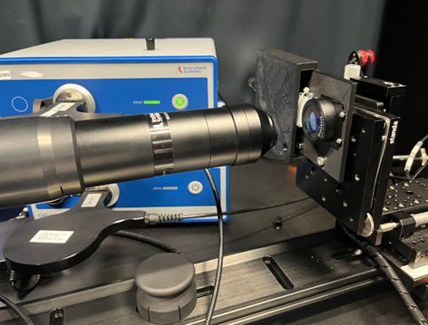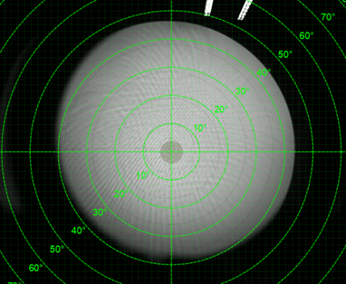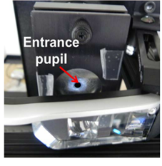

**初始对齐：**

在进行细致的调整之前，首先需要将DUT放置在尽可能准确的位置，以确保后续对齐过程的顺利进行。以下是初始对齐的关键步骤：

1. **中心对齐**：确保DUT与LMD的镜头中心对齐。这是为了确保从DUT发出的光线能够正确地通过LMD的镜头，从而获得准确的测量结果。
2. **平行对齐**：调整DUT，使其表面与AR/VR设备的镜头表面保持平行。平行对齐有助于减少因角度偏差导致的图像失真，提高对准精度。
3. **光线照射**：确保DUT发出的光线能够充分照亮LMD的入瞳处。正确的光线照射是获取清晰、准确测量数据的前提，有助于提高整个对齐过程的效率和准确性。

通过以上初始对齐步骤，可以为后续的精细调整打下良好的基础，确保整个对齐过程的高效和精确。

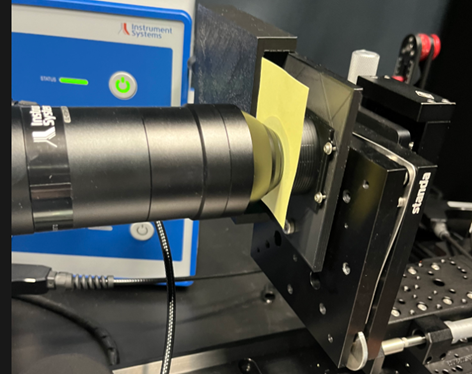

**Z轴眼距对齐**

眼距，即AR/VR设备与DUT（待测设备）之间的距离，是DUT的关键参数之一。此参数通常由设备制造商提供。若未明确给出，可以采用20毫米作为标准的默认眼距。眼距的定义可能因标准而异。一种定义将其视为从DUT镜头表面到眼睛表面的距离，而另一种则将其定义为从镜头表面到AR/VR设备入瞳处的距离。

以下是对齐Z轴眼距的步骤：

1. 使用平移台沿Z轴移动DUT，逐步减小AR/VR镜头与DUT镜头之间的距离。
2. 继续调整，直到两者之间的距离足够近，能够轻轻夹住并固定一张摆动的纸片。这一步骤旨在确保镜头间不会发生直接接触，从而避免潜在的损坏。
3. 在确保不会发生接触后，将DUT沿Z轴向外移动，直至达到预定的眼距值。

**备注**：在设置眼距时，务必考虑镜头表面与入瞳之间的实际距离，以确保精确对齐。

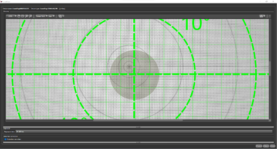

**ρ轴对齐**

- 在测量软件界面中显示十字准线图案。
- 操作DUT，使其上的十字准线与软件显示的十字准线对齐。
- 精细调整，确保DUT上的十字准线轴与测量软件中的十字准线轴保持平行，以达到预定的ρ轴设定值。
- 通过这种对齐方式，可以精确地将ρ轴定位到所需的特定角度，确保两个十字准线的轴线相互平行，从而满足对准要求。

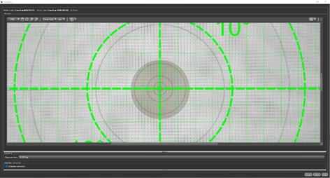

**φ方位角/θ仰角对齐**

- 在待测设备（DUT）上投射一个十字准线图案。
- 通过旋转DUT，调整φ方位角（水平旋转角度）和θ仰角（垂直旋转角度），直至DUT上的十字准线中心与测量软件界面上所显示的十字准线中心完全对齐。
- 精确对准后，确保十字准线在两个视图中的位置一致，以完成φ方位角和θ仰角的对齐工作。

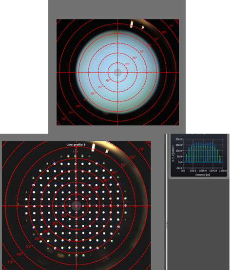

**X/Y轴对齐**

- X/Y轴的对齐主要通过调节亮度值来实现。这一过程涉及逐步调整X/Y坐标，直至亮度峰值达到视场中心，并确保整个视场（FOV）内的亮度分布达到对称状态。为精确对齐，可在测量软件中应用线函数（设定线宽以覆盖整个圆形视场的宽度），以确保视场中心等距离的点亮度一致。
- 除了依赖亮度值，对齐过程还可以借助对比度、失真度或清晰度等其他参数作为辅助手段。
- 完成X/Y轴的对齐后，可能还需要对φ方位角和θ仰角进行微调，以实现更精确的对准。需要注意的是，方位角和仰角的调整可能会影响之前X/Y轴的对齐状态，因此调整后应重新检查并适当微调X/Y轴，以保证最终的对准精度。

### 斑点（blob）对齐

本部分简要介绍了一种特殊对齐流程。在DUT的z轴与光学轴线不完全一致，且其沿z轴的距离在10毫米至大约40毫米范围内变动时，所观察到的斑点（blob）变化将呈现不对称性。以下图像展示了正确与错误对齐的两种情况。

左侧图像展示了正确对齐的示例。图中顶部为视点处的图像，底部则为视点后大约30毫米位置（远离DUT）的图像。右侧图像则揭示了错误对齐的情况，同样，顶部为视点处的图像，底部为视点后大约30毫米处的图像。在错误对齐的案例中，斑点的分布明显失去了对称性。

为了提高对齐的精度，对齐过程不仅需要考虑斑点的不对称变化，还应当包括对φ方位角和θ仰角的调整，以及x/y轴的精确对齐。这样的综合调整是确保对准精度的关键。

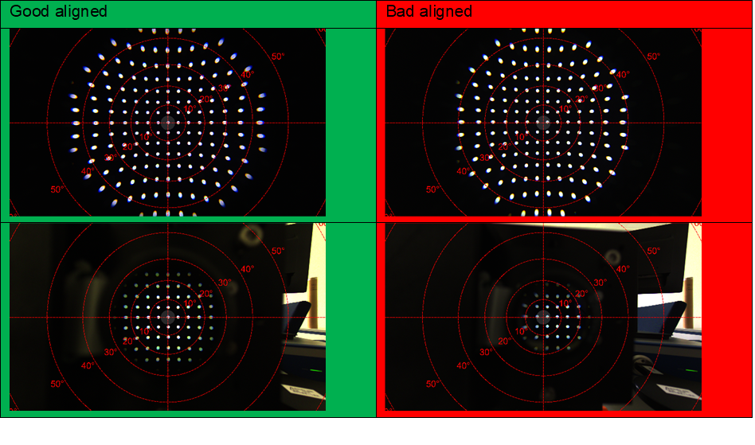