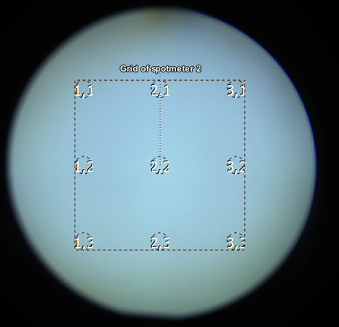
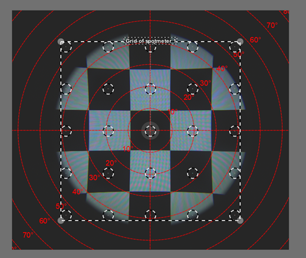
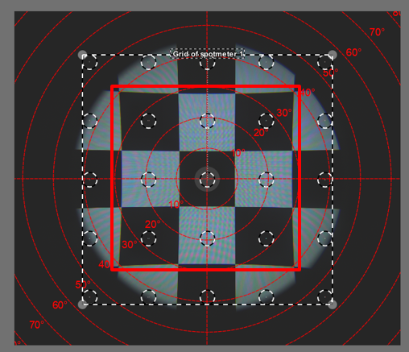

# **中心虚拟图像基本测量**：

这一部分介绍了对中心虚拟图像进行基本测量的方法。中心虚拟图像通常指的是在光学或显示系统中，通过特定方式形成的、位于光学系统中心的图像。这种图像对于评估光学系统的性能，如分辨率、对比度和均匀性等，是非常重要的。

基本测量可能包括对图像亮度和对比度的评估，以及确定图像的清晰度和稳定性。这些测量有助于确保显示系统能够提供高质量的视觉效果，特别是在关键的应用场景中，如虚拟现实（VR）或增强现实（AR）系统。

## 光测量设备（LMD）

Instrument Systems DMS803 (测角光度计）。

## **被测设备（DUT）**

配备Pancake光学元件以及 OLEDonSi 显示屏的NED设备，分辨率为  2560 px x 2560 px。

## **测试图案**

涵盖了纯白色、红色、绿色、蓝色以及黑色等多种颜色。

## **测量**

首先，将方位角和仰角均设定为 0°，然后把 LMD 放置于视点 P5 处（具体点位可参考下图 ）。

图1：在视场（FOV）尺寸中定义测量点

## **分析**

可以从 x,y 颜色坐标计算出色温（CCT）：

$$
𝐶𝐶𝑇=437𝑛^3+3601𝑛^2+6861𝑛+5514
$$

$$
𝑛=\frac{(𝑥−0.3320)}{(0.1858−𝑦)}
$$

对比度 $C_{FWS}$可以通过以下方式计算：

$$
C_{FWS}=\frac{L_w}{L_b}
$$

其中，

- $L_w$是全帧白色亮度，
- $L_b$是全帧黑色亮度。

对比度 $C_{FWS}$反映了屏幕在显示纯白色和纯黑色时亮度的差异程度。高对比度比值意味着屏幕能够显示出更深的黑色和更亮的白色，从而提供更清晰、更生动的图像。在光学测量中，对比度比值越高，通常表示显示设备的性能越好。

在计算对比度 $C_{FWS}$时，如果需要考虑屏幕背后的背景亮度对测量结果的影响，可以使用以下扩展公式：

$$
C_{FWS}=\frac{(L_w-L_{bg})}{(L_b-L_{bg})}
$$

其中，

- $L_w$是全帧白色亮度，
- $L_b$是全帧黑色亮度，
- $L_{bg}$是背景亮度（当设备关闭时的环境亮度）。

在实际应用中，如果背景亮度对测量结果的影响可以忽略不计，可以将 $L_{bg}$设置为 0 cd/m²。这意味着在计算对比度时，只考虑屏幕本身的亮度和暗度，而不考虑外部环境的影响。

## **结果**

| 主要颜色 | 亮度 (cd/m²) | x 色坐标 | y 色坐标 | 色温 (K)    | 对比度         | 色域覆盖率           |
| -------- | ------------ | -------- | -------- | ----------- | -------------- | -------------------- |
| 白色     | *106.65*     | *0.3338* | *0.3589* | <u>5437</u> | <u>>100000</u> |                      |
| 红色     | *25.56*      | *0.6549* | *0.3345* |             |                | <u>88%  (DCI-P3)</u> |
| 绿色     | *66.882*     | *0.2468* | *0.6899* |             |                |                      |
| 蓝色     | *10.387*     | *0.1746* | *0.0976* |             |                |                      |
| 黑色     | *<0.0001*    |          |          |             |                |                      |

表1：ICDM 虚拟图像中心的基本测量报告表（斜体部分表示测量数据，下划线部分则为计算结果）

# **均匀性**

本节讨论的是显示系统的均匀性。在光学和显示技术中，均匀性是指显示屏上亮度或色彩的一致性。一个均匀性高的显示屏，在其整个表面上显示相同颜色或亮度时，不会出现明显的亮度波动或色彩偏差。

均匀性的测量通常涉及对显示屏不同区域的亮度进行采样，并比较这些值以确定是否存在显著的差异。这对于确保视觉体验的质量至关重要，尤其是在需要精确色彩和亮度控制的应用中，如专业影像编辑或医疗成像。不均匀的显示可能会导致图像失真，影响用户的观感和工作效率。

## 光测量设备（LMD）

Instrument Systems LumiTop 5300 ARVR (2D光测量设备)

- 入瞳（Entrance pupil）：3mm

- 焦距：1000mm

  

## **被测设备（DUT）**

配备Pancake光学元件和 TFT-LCD 显示屏的NED设备，分辨率为 1600 px x 1600 px。

## **测试图案**

包括全实心白色、红色、绿色、蓝色和黑色，用于评估显示屏在不同颜色下的均匀性。

## **测量**

在显示屏上的 9 个不同点进行测量，以评估整个屏幕的均匀性。

| 测量点 | 视角 (FOV)                                |
| :----- | :---------------------------------------- |
| P1     | 0.7 FOV (-0.5 FOV in x and +0.5 FOV in y) |
| P2     | 0.5 FOV ( 0 FOV in x and +0.5 FOV in y)   |
| P3     | 0.7 FOV (+0.5 FOV in x and +0.5 FOV in y) |
| P4     | 0.5 FOV (-0.5 FOV in x and 0 FOV in y)    |
| P5     | 0 FOV (0 FOV in x and 0 FOV in y)         |
| P6     | 0.5 FOV (+0.5 FOV in x and 0 FOV in y)    |
| P7     | 0.7 FOV (-0.5 FOV in x and -0.5 FOV in y) |
| P8     | 0.5 FOV (0 FOV in x and -0.5 FOV in y)    |
| P9     | 0.7 FOV (+0.5 FOV in x and -0.5 FOV in y) |

表2：9点测量点位

图2：3x3点测量示意图

## **分析**

为了评估显示屏的亮度均匀性，我们定义了两个关键参数：亮度非均匀性（NU）和亮度均匀性（U）。

**亮度非均匀性 NU**（ N 个测量点）：这个参数衡量的是显示屏上不同测量点之间亮度的最大差异。计算公式为：

$$
NU=\frac{L_{vM}-L_{va}}{L_{va}}\times 100 \%
$$

其中，

- $L_{vM}$ 是所有测量点中的最大亮度，

- $L_{va}$是所有测量点的平均亮度，计算公式为:$L_{va}=\frac{1}{N}\sum^{N-1}_{i=0}L_{vi}$

- $L_{vi}$是在第 i 个点的测量亮度。

**亮度均匀性 U**：这个参数表示显示屏的整体均匀性。计算公式为：

$$
U=100\%-NU
$$

**对比度 $C_{FWS}$** 可以通过以下方式计算：

$$
C_{FWS}=\frac{L_w}{L_b}
$$

其中，

- $L_w$是全帧白色亮度，
- $L_b$是全帧黑色亮度。

如果需要考虑背景亮度对测量结果的影响，对比度比的计算可以扩展为：

$$
C_{FWS}=\frac{(L_w-L_{bg})}{(L_b-L_{bg})}
$$

其中，

- $L_{bg}$ 是背景亮度（当设备关闭时的环境亮度）。

## **结果**

|   位置   | 白色亮度(cd/m²) | 红色亮度(cd/m²) | 绿色亮度(cd/m²) | 蓝色亮度(cd/m²) | 黑色亮度(cd/m²) |   对比度   |
| :------: | :-------------: | :-------------: | :-------------: | :-------------: | :-------------: | :--------: |
|    P1    |     *131.2*     |     *18.79*     |     *102.9*     |      *9.5*      |     *0.35*      | <u>377</u> |
|    P2    |     *142.5*     |     *19.99*     |     *111.7*     |     *10.7*      |     *0.34*      | <u>418</u> |
|    P3    |     *131.7*     |     *18.51*     |     *103.4*     |      *9.9*      |     *0.35*      | <u>378</u> |
|    P4    |     *143.1*     |     *20.15*     |     *111.9*     |     *10.6*      |     *0.30*      | <u>473</u> |
|    P5    |     *153.9*     |     *21.31*     |     *120.6*     |     *11.3*      |     *0.33*      | <u>467</u> |
|    P6    |     *144.0*     |     *20.24*     |     *112.7*     |     *10.7*      |     *0.32*      | <u>449</u> |
|    P7    |     *137.0*     |     *19.27*     |     *107.0*     |     *10.1*      |     *0.30*      | <u>457</u> |
|    P8    |     *145.3*     |     *20.40*     |     *113.4*     |     *10.9*      |     *0.31*      | <u>476</u> |
|    P9    |     *133.3*     |     *18.67*     |     *104.0*     |      *9.8*      |      0.32       | <u>419</u> |
|  最小值  |     *131.2*     |     *18.51*     |     *102.9*     |      *9.5*      |      0.30       |            |
|  最大值  |     *153.9*     |     *21.31*     |     *120.6*     |     *11.3*      |      0.35       |            |
|  平均值  |  <u>140.2</u>   |  <u>19.70</u>   |  <u>109.7</u>   |   <u>10.4</u>   |   <u>0.32</u>   |            |
| 非均匀性 |   <u>10%</u>    |    <u>8%</u>    |   <u>10%</u>    |    <u>9%</u>    |    <u>8%</u>    |            |
|  均匀性  |   <u>90%</u>    |   <u>92%</u>    |   <u>90%</u>    |   <u>91%</u>    |   <u>92%</u>    |            |

表3：均匀性测量报告表（斜体部分表示测量数据，下划线部分则为计算结果）

# **对比度**：

对比度是衡量显示设备性能的一个重要参数，它反映了屏幕上最亮区域和最暗区域之间的亮度差异。一个高对比度的显示设备能够提供更深沉的黑色和更明亮的白色，从而产生更生动、更清晰的图像。

## 光测量设备（LMD）

Instrument Systems LumiTop 5300 ARVR (2D光测量设备)

- 入瞳（Entrance pupil）：3mm

- 焦距：1000mm

  

## **被测设备（DUT）**

配备Pancake光学元件和 TFT-LCD 显示屏的NED设备，分辨率为 1600 px x 1600 px。

## **测试图案**

测试图案使用了 5x5 的棋盘图案。

图3：对比度测量测试图案

## **测量**

2D光测量设备被设置使用极坐标进行测量，进行了两次测量：一次使用白色中心的棋盘图案，另一次使用黑色中心的棋盘图案。这种测量方法有助于评估显示器在显示纯白色和纯黑色时的亮度和对比度性能，以及在不同亮度区域之间的过渡效果。

图4： 对比度示例测量

## **分析**

在对比度分析中，仅使用棋盘图案红色方框区域内进行测量。

图5：红框显示了被分析的区域

## **结果**

测量的对比度总结在下表中：

| **65.8** | 43.3 | 79.0 |
| :------: | :--: | :--: |
|   58.3   | 60.7 | 44.4 |
|   56.7   | 43.5 | 51.1 |

表4：标记的 3x3 点的对比度

**注意：对比度受 LMD 光学系统影响**：

对比度在测量过程中可能会受到LMD光学系统特性的影响。例如，LMD 内部的散射现象可能会改变测量结果，通常会导致对比度值降低。为了获得更准确的测量结果，可以将测量设备特征化，即测量设备对结果的影响被量化并从最终测量值中减去。然而，在某些情况下（如 NED 设备），这种特征化过程可能会比较复杂。

LumiTop ARVR （2D光测量设备）在使用棋盘图案时通常会测量出比 DMS（测角光度计） 低的对比度，这一差异主要是由于 LumiTop 镜头中的光散射现象更为显著。

| 使用 LumiTop 5300 ARVR 测量的对比度（中心点，P5） | 60.7  |
| :------------------------------------------------ | :---- |
| 使用 DMS-803 测量的对比度（中心点，P5）           | 139.2 |

表5： LumiTop 与 DMS棋盘图案对比度比较
