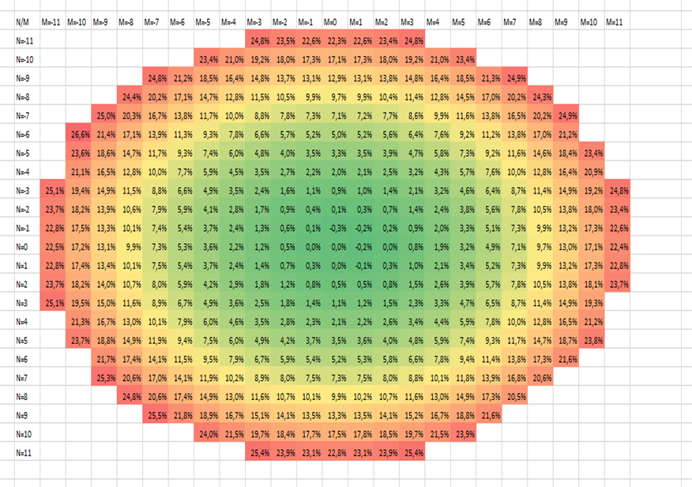

# 畸变测量

在制造AR/VR/MR设备时，精确测量近眼显示器的光学畸变是关键环节。这种畸变源于透镜的特性，因此，为了有效补偿这一现象，设备需准确掌握畸变信息，
备注：畸变分析使用笛卡尔坐标系。

## 光测量设备（LMD）

Instrument Systems LumiTop 5300 ARVR (2D光测量设备)

- 入瞳（Entrance pupil）：3mm

- 焦距：1000mm

  

## **被测设备（DUT）**

配备Pancake光学元件以及 OLEDonSi 显示屏的NED设备，分辨率为  2560 px x 2560 px。

## 测试图案

使用斑点（blob）图案进行畸变测量（见图21）。

- 25x25个斑点

- 测试图案尺寸2560 px x 2560 px

- 斑点间距100 px

- 斑点半径15 px

  

图1： 用于红色畸变测量的斑点图案

## 测量

图2展示了使用红色斑点图案进行镜头畸变测量的示例。这种测量方法通过分析图像中圆点的变形程度来确定镜头的畸变程度。

图2：使用红色斑点图案进行镜头畸变测量的示例。

## 分析

畸变分析的主要步骤包括：
1. 检测圆点的位置。

2. 利用靠近图像中心的圆点生成一个预期位置的网格。这一步假设中心附近的圆点畸变可以忽略。

3. 计算每个圆点$d_{i,j}$的畸变程度: 

$$
   d_{i,j}=\frac{h'_{i,j}-h_{i,j}}{h_{i,j}}
$$

   其中，

   - $d_{i,j}$ 表示索引为 i 和 j 的圆点的畸变程度，

   - i 和 j 是圆点相对于中心圆点的索引（中心圆点的索引为 i=j=0），

   - $h'_{i,j}$ 是索引为 i,j 的圆点相对于中心的实际测量距离，

   - $h_{i,j}$ 是根据图像中心圆点间距离确定的格距 m 计算出的索引为 i,j 的圆点的预期距离，
     公式为:
     
     $$
     h_{i,j}=\sqrt{(i\times m)^2+(j\times m)^2}
     $$

   图3给出了预期和实际测量圆点位置的一个示例。

   

图3：红色图案的预期（蓝色圆点）和实际（红色方块）测量圆点位置

对所使用的DUT进行的测量显示，畸变达到了26.6%（参见下图）。

图4：红色图案的畸变测量结果

# 扭曲图像的畸变测量

通过畸变测量得到的结果，用户可以创建一个模型来预先补偿图像的畸变。这种方法通过调整显示图像的方式来校正畸变。下图展示了用于预补偿畸变的圆点图案。

图5：红色图案的预补偿圆点图案

应用了预补偿图案后，可见的图案如图6所示。这个图案经过畸变预补偿处理，能够更准确地显示，减少了因镜头畸变引起的图像扭曲。

图6：展示了使用预补偿图案的NED的显示图像。通过预补偿图案，图像的畸变得到了校正，使得显示效果更加真实和准确。

使用真实的照片，预补偿图案和NED显示的图像分别展示在图7中，而在图8中直接比较了未使用预补偿和使用预补偿图案作为输入的情况。

图7： 左：预补偿图像；右：NED显示的图像

图8：左：未使用预补偿图像的显示图像；右：使用预补偿图像的显示图像

# 色差测量

在畸变测量过程中记录的数据可以用来量化色差。这通过比较不同颜色通道（如红色、绿色和蓝色）中圆点的位置来实现。色差是由于镜头对不同颜色光的聚焦能力不同而产生的，这种差异会导致图像颜色边缘出现模糊或色晕。

图9：展示了使用白色圆点图案放大的圆点，以显示色差。在这里，不同颜色通道的圆点位置差异清晰可见，这种差异就是色差，它会导致图像颜色边缘出现模糊或色晕。
