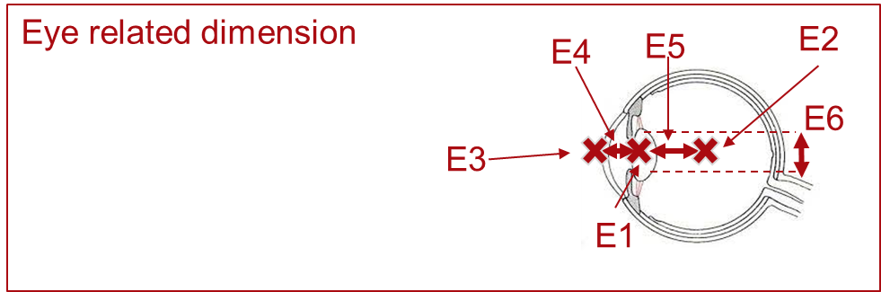
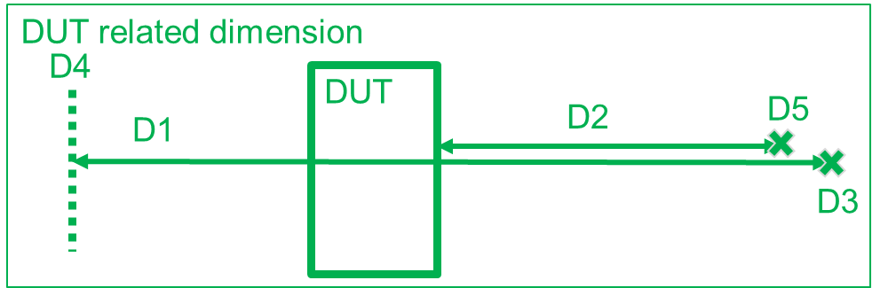
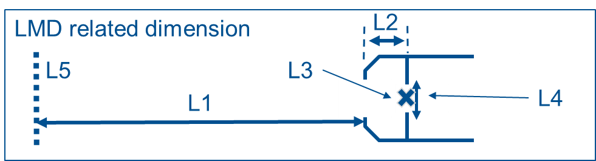
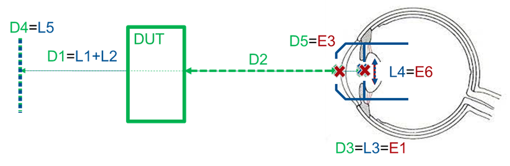
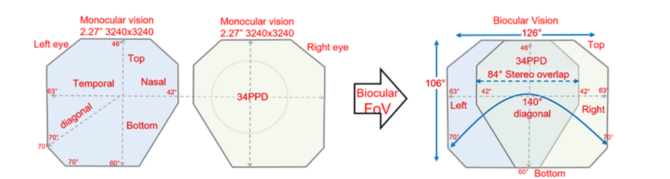
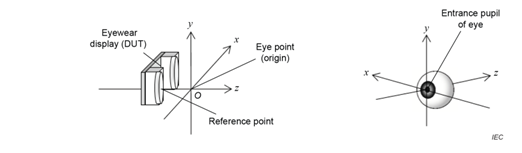
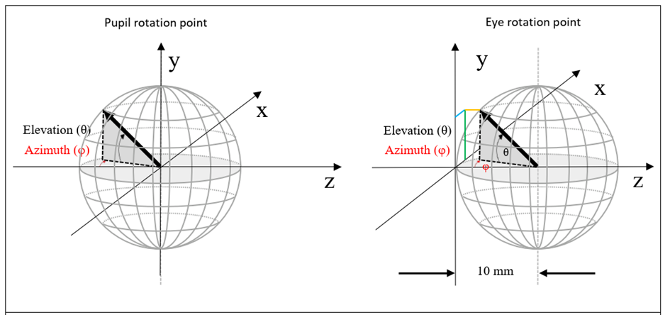

本节内容详细介绍了与眼睛、待测设备（DUT）、光测量设备（LMD）以及增强现实（AR）/虚拟现实（VR）头戴显示设备相关的尺寸规格和术语。文中不仅为这些设备提供了精确的尺寸定义，而且还介绍了多个坐标系统。具体来说，待测设备（DUT）和光学测量设备（LMD）各有一套独立的坐标系统。此外，本文档还解释了这些坐标系统如何与人类眼睛的位置和视角相关联，从而确保测量和显示的准确性。

# 与眼睛相关的尺寸和定义

| 符号 | 名称                     | 描述                                                         |
| ---- | ------------------------ | ------------------------------------------------------------ |
| E1   | 瞳孔点                   | 眼睛入瞳的中心。                                             |
| E2   | 眼睛旋转点               | 眼睛的中心，也是眼睛旋转的中心。常用于基于眼睛注视的测量，例如畸变或MTF（调制传递函数）。 |
| E3   | 角膜顶点                 | 角膜表面的最前点。                                           |
| E4   | 角膜顶点至瞳孔点的距离   | 角膜顶点（E3）与瞳孔点（E1）之间的距离，标准值为3毫米（IEC63145-20-10/ICDM）。 |
| E5   | 眼睛旋转点至瞳孔点的距离 | 眼睛旋转点（E2）与瞳孔点（E1）之间的距离，标准值为10毫米（IEC63145-20-10/ICDM）。 |
| E6   | 眼睛入瞳直径             | 眼睛入瞳的直径。                                             |

# 与DUT（被测设备）相关的尺寸和定义

| 符号 | 名称           | 描述                                                         |
| ---- | -------------- | ------------------------------------------------------------ |
| D1   | 虚拟像距或焦距 | 眼睛点（D3）到虚拟像平面（D4）之间的距离。                   |
| D2   | 眼睛间隔       | 角膜顶点（D5）（眼睛的）到虚拟像显示设备最近光学元件的距离（IEC63145-20-10）。实际应用中，通常将眼睛间隔定义为最近光学元件与眼睛点之间的距离。 |
| D3   | 眼睛点         | 设计位置，在此位置放置眼睛的入瞳，以在使用眼镜显示设备时达到最佳性能，并作为测量的原点位置（IEC63145-20-10）。 |
| D4   | 虚拟像（平面） | 由DUT的光学元件生成的虚拟像。                                |
| D5   | 角膜顶点       | 角膜表面的最前点。D5与E3相同。                               |

# 与光测量设备（LMD）相关的尺寸和定义

| 符号 | 名称                            | 描述                                        |
| ---- | ------------------------------- | ------------------------------------------- |
| L1   | 焦距                            | 镜头到焦点的距离。                          |
| L2   | LMD入瞳至光测量设备前表面的距离 | LMD入瞳（L4）与光测量设备前表面之间的距离。 |
| L3   | LMD瞳孔点                       | LMD入瞳的中心。                             |
| L4   | LMD入瞳直径                     | LMD入瞳的直径。                             |
| L5   | 焦平面                          | 在焦距处的物平面。                          |

在系统良好对齐的情况下，所有对应点应相互重叠（参见图1）。

图1：显示了与DUT对齐的测量设备，并标出了与眼睛相关的尺寸。

# AR/VR头戴显示设备中的常见术语

图2展示了AR/MR/VR系统常用术语。有时，“Top”也称为“Sky”，“Bottom”称为“Ground”。

图2：AR/VR头戴显示设备术语与位置

# 坐标系统

VR测量中有两个关键坐标系统：

- **DUT坐标系统**：由被测设备定义。
- **测量设备坐标系统**：由测量设备定义。

根据国际电工委员会（IEC）2019年发布的《IEC 63145-20-10:2019 Eyewear display - Part 20-10: Fundamental measurement methods - Optical properties》中的坐标系统（参见图3）。

图3：坐标系定义，来源：《IEC 63145-20-10:2019 Eyewear display - Part 20-10: Fundamental measurement methods - Optical properties》

若需模拟视线，应将眼睛的旋转点作为旋转中心（参见图4）。

图4：坐标系定义，来源：信息显示测量标准（ICDM）发布的《ICDM - Information Display Measurements Standard-V1.1a, 2022》

# 不同坐标系统的表示方法

为了适应不同的应用场景和个人喜好，AR/VR/MR应用允许用户选择多种坐标系统。在AR/VR/MR应用中，通常使用笛卡尔坐标系或球形（极坐标）坐标系。

- **笛卡尔坐标系**：x, y, z
- **球形（极坐标）坐标系**：θ, φ, R（其中θ表示仰角，φ表示方位角，R表示到原点的距离，即球体的半径）。

在进行畸变测量时，笛卡尔坐标系因其直观性而得到广泛应用。而在进行像素密度测量时，球形坐标系则更加适用，因为它可以更好地反映屏幕上像素的分布情况。在二维测量中，由于不考虑深度信息，坐标的表示方式简化为：

- **笛卡尔坐标系**：x, y

- **球形（极坐标）坐标系**：θ, φ
